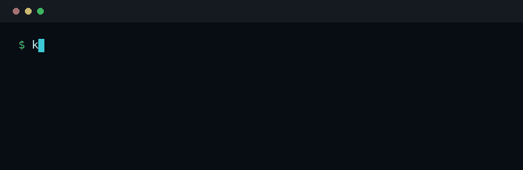

<div align="center">


**kern:** A fast, rootless sandbox and virtual resource runtime for any workload, including untrusted and AI-generated code.

**A real, kernel-enforced container in ~3.4 ms, out of one 1.58 MB binary with no daemon.**

<p align="center">
  
</p>

<sub>**0 RAM at rest** · no daemon, no socket, nothing to start · one static binary, `libc` its only Rust dependency</sub>

[](https://github.com/getkern/kern/actions/workflows/ci.yml)
[](LICENSE)
[%20%C2%B7%20ARM%20boards-informational.svg)](docs/INSTALL.md)

</div>

```sh
# install from source (no published binaries yet, needs a Rust toolchain)
cargo install --git https://github.com/getkern/kern getkern --locked

# a throwaway shell in a real OCI image: rootless, kernel-enforced, a few ms
kern box dev --image alpine -it -- sh
```

<sub>No native Windows: use WSL2. [Install](#install).</sub>

---

## What kern is

kern runs Linux workloads in real, kernel-enforced sandboxes: user, PID, mount, network, UTS and IPC
namespaces, an overlay or read-only root pivoted in, an always-on seccomp filter, and cgroup v2
limits. It pulls OCI images, builds them, runs them, and gets out of the way. No daemon, one
short-lived process per box.

It is 1.58 MB (the size-optimized release build; a from-source `cargo install` is ~2 MB) because it
carries only what it has to: the entire Rust dependency tree is `libc`,
JSON and OCI manifests are parsed by hand, and `pull` uses the `curl` and `tar` already on the
machine instead of linking a TLS stack and a decompressor. `kern doctor` checks for those two; a box
from a `--rootfs` needs neither.

It has **two verbs**. `kern box` wraps a process in a full isolated slice. `kern run` caps a resource
on a process you launch yourself, with no sandbox. Isolation is simply the first resource kern
manages; the same model slices CPU (`vcpu:`), memory, disk (`vdisk:`) and devices (`vgpio:`), defined
once in a `kern.toml` and attached by name. [docs/RESOURCES.md](docs/RESOURCES.md).

<p align="center">
  
</p>

## What kern is not

- **Not a hypervisor.** The boundary is the Linux kernel, so a kernel privilege-escalation bug is an
  escape. For actively hostile, multi-tenant code from strangers, reach for a microVM (Firecracker,
  Kata) or gVisor. kern's ground is your own or semi-trusted code: CI jobs, build steps, dev
  sandboxes, an agent's tool-calls under your supervision.

  This is the container model, not a kern limitation: Docker and Podman share the same kernel and the
  same escape condition, which is why gVisor and Firecracker exist. Where kern differs is which side
  you start on: rootless always, where Docker's daemon runs as root and rootless is opt-in.
- **Not free of the userns trade.** kern's isolation is built on an unprivileged user namespace, and
  userns has been a fertile source of kernel LPE bugs. Running untrusted code in a box hands it that
  surface to probe. [SECURITY.md](SECURITY.md) states this first, before any claim.
- **Not a wall around what you mount in.** A `-v` bind hands the box read/write on that host path;
  `-v $HOME:/host` gives it your home directory. A mount is a trust decision you make, not a boundary
  kern enforces: mount only what the workload needs, and `:ro` when it only reads. (The one thing kern
  refuses to bind is its OWN runtime registry, which would hand a box another box's secrets and state.)
  Likewise `--net host` and `--privileged` are opt-outs of the isolation, by name.
- **Not a Docker Engine reimplementation.** kern speaks Docker's *formats*, images and
  `docker-compose.yml` and Dockerfiles, not its API. No overlay networks, no plugin ecosystem, no
  Swarm. Full matrix: [docs/DOCKER-COMPAT.md](docs/DOCKER-COMPAT.md).
- **Not a Kubernetes runtime.** It does not implement CRI. For that, use containerd or CRI-O.
- **Not shipping GPU slices.** They are on the [roadmap](ROADMAP.md) and there is no GPU code in this
  edition, so there is nothing here to trust or to attack yet.

What it does not know or does not do yet is in [OPEN_ITEMS.md](OPEN_ITEMS.md) rather than left for
you to find: whether a mapped seccomp filter helps an attacker who already runs code, and which fleet
limit is a guard rail instead of a boundary.

## Install

kern needs a Linux kernel with unprivileged user namespaces and cgroup v2. It runs on **Linux, WSL2
and ARM boards** (Raspberry Pi · Jetson · Arduino UNO Q); there is **no native Windows** build, use
WSL2 (kern ships a pre-baked WSL rootfs).

There are no published binaries yet, so you build it from source. The whole dependency tree is one
crate (`libc`), so this is short: clone, build and install took 36 s on a desktop (i7-14700KF),
longer on a small ARM board.

```sh
# if you do not have Rust yet
curl --proto '=https' --tlsv1.2 -sSf https://sh.rustup.rs | sh

cargo install --git https://github.com/getkern/kern getkern --locked
```

That puts `kern` in `~/.cargo/bin`, which rustup adds to your `PATH` (open a new shell, or
`source "$HOME/.cargo/env"`, if `kern` is not found).

Once a release is published, [`install.sh`](install.sh) fetches the binary for your architecture and
verifies its SHA256 (`curl -fsSL .../install.sh | sh`); until then it has nothing to download.

`kern doctor` tells you whether boxes will run here before you try. Boards, WSL2 and the long form:
[docs/INSTALL.md](docs/INSTALL.md). Common questions (Docker, bubblewrap, youki, E2B, Windows, the
threat model): [docs/FAQ.md](docs/FAQ.md).

## Quickstart

```sh
kern box dev --image alpine -it -- sh              # a throwaway shell in a real OCI image
kern run --memory 256M --cpus 0.5 -- ./crunch      # cap a process, no sandbox
kern box svc --image nginx:alpine -d -p 8080:80 \  # a service: published, restarted, health-checked
  --restart --health-cmd 'wget -qO- localhost:80' -- nginx -g 'daemon off;'
kern ps                                            # what is running, with PORTS and HEALTH
kern exec svc -it -- sh                            # shell into it
kern top                                           # live TUI: boxes, CPU/RAM, profiles, volumes
kern compose stack.toml up                         # a multi-box stack (examples/) or a compose.yml
```

Untrusted code, one flag for the bundle:

```sh
kern box job --image python:3.12-slim --security-profile untrusted --memory 256m \
  -v ./job:/w -- python3 /w/x.py
```

`--security-profile untrusted` is the seccomp **allowlist** + `--cap-drop ALL` + `--read-only` in one
opt-in flag (spell them out by hand if you prefer); add `--require-limits` to refuse to start unless the
memory/pids caps are actually enforced. No network unless you ask, dangerous capabilities dropped,
seccomp always on. Ninety runnable examples, each doing one thing: [examples/](examples/).

Every read verb also answers in JSON, so nothing has to parse a table:

```sh
kern ps --json | jq '.[] | select(.health == "unhealthy") | .name'
kern volume ls --json          # ps · images · stats · inspect · builds · pod ls · config list · diff
```

## Your Docker Compose stack, without Docker Desktop

kern speaks `docker-compose.yml`. Point it at the stack you already have and `kern compose up` runs it
with no daemon and no Docker Desktop, the same on Linux, WSL2 and ARM boards.

```yaml
# compose.yaml - a real stack, unchanged
services:
  db:
    image: postgres:alpine
    environment: { POSTGRES_PASSWORD: secret, POSTGRES_DB: app }
  web:
    image: adminer
    ports: ["8080:8080"]
    depends_on: [db]
```

```sh
kern compose compose.yaml up
```

Both official images start, `web` reaches `db` by service name, and the port is published to the host.
Warm (images cached) the web tier serves in **~0.3 s**, and the stack costs only what postgres and adminer
actually use (~66 MB here) with **zero daemon** on top, where Docker Desktop is a background VM before your
first container.

Official images that drop to a non-root user (postgres, redis, ...) want `uidmap` and a `/etc/subuid`
line, and outbound image pulls want `pasta`; both are one `apt install` on a dev box, and `kern doctor`
names either if it is missing. This is the local dev loop, not a production orchestrator: no Swarm, no
overlay networks.

## Embed it: Python & Node

Run agent or LLM-generated code from your own program with
**[`kern-sandbox`](bindings/python/README.md)**, a thin, dependency-free wrapper over the `kern`
binary. Every call runs in a fresh isolated box: network off, memory and pid caps, capabilities
dropped, output bounded, and a timeout the binding itself enforces.

```sh
pip install kern-sandbox        # PyPI
npm  install kern-sandbox       # npm
```

```python
from kern_sandbox import run_code

r = run_code("import platform; print(platform.python_version())")
print(r.stdout)          # ran in a fresh box; a timeout / OOM / blocked escape is data on r.fault
```

- **Fresh box per call** by default; a `Sandbox` persists a workspace across calls, and a warm
  `kernel()` keeps one interpreter for sub-millisecond cells (weaker isolation, by choice).
- **Faults are data, not exceptions**: a timeout, OOM-kill or blocked syscall is a field on the
  result; only a box that failed to *start* raises.
- **Rich results without a Jupyter kernel**: the last expression, `display()`, and matplotlib figures
  are captured, like a notebook cell.
- Ships an **MCP server** (`kern-mcp`) for Claude Desktop and Cursor.

Full API, Python and Node: [bindings/python/README.md](bindings/python/README.md) ·
[bindings/node/README.md](bindings/node/README.md).

## Resource profiles

A slice is declared once in `~/.config/kern/kern.toml` and attached by name, to a sandboxed box or a
bare process, with the same token.

```toml
[[cpu]]                     # the host budget a slice is carved from
id    = "cpu:0"
cores = 8.0

[[vcpu]]                    # 1.5 cores and 512 MiB  ->  attach as  vcpu:heavy
name    = "heavy"
backend = "cpu:0"
cpus    = 1.5
memory  = "512m"

[[disk]]                    # a physical pool a vdisk can be placed on
id   = "pool"
path = "/var/lib/kern/disks"

[[vdisk]]                   # a 64 MiB scratch disk   ->  attach as  vdisk:scratch
name    = "scratch"
backend = "disk:pool"       # or "ram" for a RAM-backed tmpfs, with no [[disk]] block at all
size    = "64m"

[[gpio]]                    # a controller anchor
id = "gpio:0"

[[vgpio]]                   # exactly one device node ->  attach as  vgpio:sensor
name    = "sensor"
backend = "gpio:0"
i2c     = ["/dev/i2c-1"]
```

```sh
kern validate ~/.config/kern/kern.toml       # check it before anything runs
kern box train --image alpine vcpu:heavy vdisk:scratch -- ./train.sh
kern run vcpu:heavy -- ./train.sh            # the same slice, no sandbox
kern box iot --image alpine vgpio:sensor -- ls /dev
```

Declare as many `[[disk]]` pools as you have, one path each, and give a `vdisk:` exactly one
`backend`: a pool id or `ram`. There is no "disk and ram", but several `vdisk:` with different
backends attach to one box, each with its own cap. A backend naming no declared pool is refused when
the config is read, not when the box runs.

A `vdisk:` is a RAM-backed tmpfs when kern runs rootless, whatever its backend says, and an
ext4-on-loop image with a real disk quota when it runs privileged in the foreground. kern says which
one you got, per profile, rather than letting you assume, and the size cap is enforced either way.

Profiles compose: several attach to one box, and an explicit flag beats a profile's own value. Every
key is spelled like its CLI flag, so `cpus` is `--cpus` and `memory` is `--memory`.
[docs/RESOURCES.md](docs/RESOURCES.md) has the field-by-field schema.

**`vgpio:` is chip-granular, not per-line.** Asking for `pins` binds the whole `/dev/gpiochipN`, and
that character device exposes every line of that controller. `pins = [17]` does not restrict the box
to line 17: the kernel has no per-line mount boundary, so the pin list is cooperative metadata rather
than a boundary. Naming a device node, as `i2c` above does, grants that node and nothing else.

## kern vs Docker vs Podman

| | kern | Docker | Podman |
|---|---|---|---|
| Daemon | **no** | yes (`dockerd` + `containerd`) | no |
| Rootless | **yes**, always | opt-in | yes |
| Cold start, bare box | **~2.2 ms** | ~294 ms | ~281 ms |
| Cold start, from an OCI image | **~3.4 ms** | ~294 ms | ~281 ms |
| Resident memory, nothing running | **0** | 154 to 160 MB | 0 |
| Footprint | **one 1.58 MB binary** | daemon stack | multi-binary install |
| OCI images, pull / build / push | yes | yes | yes |
| `docker-compose.yml` | yes, read as-is | yes | partial |
| Overlay networks, Swarm, CRI | **no** | yes | partial |
| GPU | on the roadmap | yes | yes |

## Performance

Measured 2026-08-01 on an Intel i7-14700KF, Linux 7.0.0, against the runtimes installed there. Every
number comes from one script you can run yourself, `python3 examples/benchmark.py`. Medians on that
machine; yours will differ with your CPU, kernel and filesystem, which is why the table above rounds.

| | kern | bubblewrap | runc | podman | docker |
|---|---:|---:|---:|---:|---:|
| Cold start (bare box) | **2.2 ms** | 3.0 ms | 13.2 ms | 281.5 ms | 294.4 ms |
| 200 boxes in parallel | **0.09 s** | 0.19 s | 0.30 s | 41.8 s | 16.6 s |

A thousand simultaneous boxes take 0.61 s, all 1000 of them. One more live box costs 0.35 MB of real
memory. `exec` into a running box is 0.79 ms against Docker's 43.3.

Re-run on 2026-08-03: 2.3 ms, 0.10 s, `exec` 0.66 ms. The whole table moved by that much on the day,
**bubblewrap included**, which is the machine's state rather than kern's code.

Nobody wins single-shot latency outright: the physical floor for `unshare` + `exec` is 1 to 2 ms, so
the top tier sits inside its own run-to-run noise. At the same level of work kern is ahead of
bubblewrap on **every host where both are installed**, 2.2 ms against 2.9 here, 3.5 against 5.6 on a
Jetson, 9.6 against 15.0 on an Arduino, and still ahead at 4.2 and 11.3 while enforcing a cgroup cap
bubblewrap does not enforce at all. bubblewrap is a launcher with no images, caps or lifecycle. The
gap that matters is to the engines, 128 to 134x above. Method, per-phase breakdown, board numbers
and caveats: **[BENCHMARKS.md](BENCHMARKS.md)**.

## Security

Namespaces, a `pivot_root`, 16 dangerous capabilities dropped before exec, an always-on seccomp
**allowlist** by default (moby's own default filter minus kern's 35 escape syscalls, which stay
hard-killed; a syscall outside the vetted set returns `ENOSYS`, and the wider denylist is the opt-out
via `KERN_SECCOMP=denylist`), cgroup v2 limits (`--require-limits` refuses to start unless they bind),
and a deny-by-default `/dev`. Where a boundary is cooperative rather than kernel-enforced,
[SECURITY.md](SECURITY.md) says so and names the bypass.

You do not have to take it on trust: [pentest/](pentest/) holds four adversarial suites that assert
those boundaries against the kernel rather than against kern's own reporting, and they run without a
registry account or a network.

```sh
sh pentest/run-with-local-registry.sh ./target/release/kern pentest/pentest-ports.sh
```

Report a vulnerability privately via GitHub Security Advisories or hello@getkern.dev.

## Documentation

| | |
|---|---|
| [docs/INSTALL.md](docs/INSTALL.md) | install on Linux, WSL2 and ARM boards, from source |
| [docs/DOCKER-COMPAT.md](docs/DOCKER-COMPAT.md) | what of Docker works, what does not, and where it differs |
| [docs/RESOURCES.md](docs/RESOURCES.md) · [docs/CONFIG.md](docs/CONFIG.md) · [docs/STORAGE.md](docs/STORAGE.md) · [docs/EGRESS.md](docs/EGRESS.md) | the two-verb model, the `kern.toml` schema, volumes and egress |
| [docs/THREAT_MODEL.md](docs/THREAT_MODEL.md) · [SECURITY.md](SECURITY.md) · [OPEN_ITEMS.md](OPEN_ITEMS.md) | the threat model (structured, then per-mechanism), and the known gaps |
| [BENCHMARKS.md](BENCHMARKS.md) · [EDGE.md](EDGE.md) | measurements, and running on a Pi, Jetson or UNO Q |
| [examples/](examples/) · [blog/](blog/) | ninety runnable scripts, and longer write-ups |
| [bindings/python/README.md](bindings/python/README.md) · [bindings/node/README.md](bindings/node/README.md) | the `kern-sandbox` SDK: embed kern in Python or Node |

## Status

**The core is done. Everything above works today and is tested:** 819 Rust, 78 Python and 61 Node
tests, clippy-clean, `cargo-deny`-clean. You build from source, and the CLI
and config surface can still change, always called out in [CHANGELOG.md](CHANGELOG.md). It is being
tested hard on real hardware (Linux, WSL2, Raspberry Pi, Jetson, Arduino UNO Q) and refined ahead of
a first publication. Commits are signed.

## Contributing

Issues and pull requests are welcome. [CONTRIBUTING.md](CONTRIBUTING.md) has the workflow and the
gates; contributions are covered by the [CLA](CLA.md).

## Maintainer

Alex, [@realexhub](https://github.com/realexhub). Commits come from
[@getkerndev](https://github.com/getkerndev), the project's commit identity, so every commit has the
same author and the same signing key.

## License

Apache-2.0. See [LICENSE](LICENSE) and [TRADEMARK.md](TRADEMARK.md).
