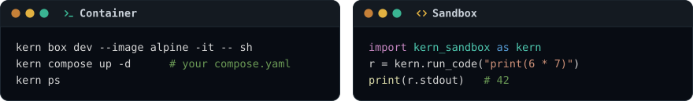
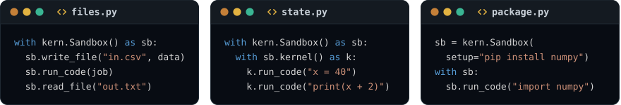
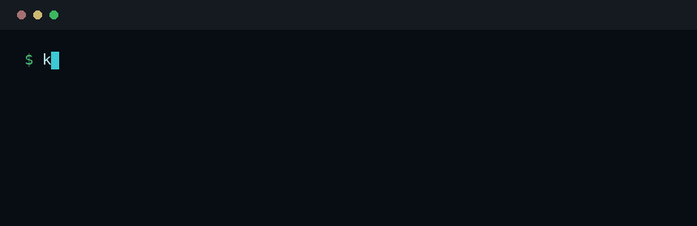

<div align="center">


[](https://github.com/getkern/kern/actions/workflows/ci.yml)
[](LICENSE)
[](https://github.com/getkern/kern/releases/latest)
[](https://pypi.org/project/kern-sandbox/)
[](https://www.npmjs.com/package/kern-sandbox)
[](docs/INSTALL.md)

**kern:** a fast, rootless container runtime and sandbox with no daemon. It runs workloads, including agent tool calls and code generated by an LLM, in real containers enforced by the kernel.


**A real, kernel-enforced container in a few milliseconds, out of one static binary with no daemon.**

**MCP support** for Claude Code, Cursor, Claude Desktop and LM Studio, through Kern Sandbox.



<sub>**0 RAM at rest** · no daemon, no socket, nothing to start · one static binary, `libc` its only Rust dependency</sub>

</div>

```sh
# Linux. Windows and macOS below.
curl -fsSL https://raw.githubusercontent.com/getkern/kern/main/install.sh | sh
```

---

## What kern is

A rootless container runtime in one static binary, with no daemon. The same binary is the sandbox an
agent's code runs in, called from Python, Node or any MCP client. kern calls a container a **box**.

- **Real OCI images**: `pull`, `build`, `commit`, `push`, `save`/`load`. A box starts in single-digit
  milliseconds.
- **A sandbox for code your model wrote.** It runs where it can't touch your machine, with no
  network unless you ask.
- **Rootless, always.** Six namespaces, a read-only or overlay root, a seccomp allowlist, cgroup v2
  limits.
- **Your `docker-compose.yml`, unchanged**, or kern's own `stack.toml`.
- **Limits without a sandbox.** `kern run` puts the same caps on a plain process on the host.
  [docs/RESOURCES.md](docs/RESOURCES.md)
- **The tools you expect**: `ps`, `logs`, `exec`, `stats`, `inspect`, `top`, `doctor`.

## Install


```sh
curl -fsSL https://raw.githubusercontent.com/getkern/kern/main/install.sh | sh
```


```powershell
irm https://raw.githubusercontent.com/getkern/kern/main/install.ps1 | iex
```


```sh
brew install colima
colima start
colima ssh
```

Then, inside the VM:

```sh
curl -fsSL https://raw.githubusercontent.com/getkern/kern/main/install.sh | sh
```

Kern Sandbox goes in the VM too, with the code that calls it: `pip install kern-sandbox` there.

Then `kern doctor` checks the host and says what to fix. Ubuntu 23.10 and newer need one root step
first: [docs/INSTALL.md](docs/INSTALL.md#linux).

## Quickstart

| What it does | Command |
|---|---|
| A shell in a real OCI image | `kern box dev --image alpine -it -- sh` |
| A service, published on the host | `kern box svc --image nginx:alpine -d -p 8080:80` |
| Untrusted code, with the strict profile | `kern box job --image python:3.12-slim --security-profile untrusted -- python3 -c "print('hi')"` |
| What is running (`--json` too) | `kern ps` |

`--security-profile untrusted` is the seccomp allowlist, `--cap-drop ALL` and `--read-only` in one
flag. [examples/](examples/) holds 94 runnable scripts, one per thing kern does.

## Kern Sandbox: run an agent's code from Python or Node

In a terminal:

```sh
python3 -m venv .venv && . .venv/bin/activate
```

```sh
pip install -U kern-sandbox
```

Then in a Python file:

```python
import kern_sandbox as kern

r = kern.run_code("print(sum(range(100)))")
print(r.stdout, r.fault)   # 4950  None
```

Your code runs in a container of its own, for one call or for a whole session, and a timeout or an
out-of-memory comes back as a typed `fault`. On Linux, pip brings kern with it.
Node: `npm install kern-sandbox`, with kern from the install line above.



These three and three more, ready to copy: [the Python SDK](bindings/python/README.md#the-basics-one-call-each),
[the same for Node](bindings/node/README.md).

**MCP server** for Claude Code, Cursor, Claude Desktop and LM Studio. The same block goes in
`claude_desktop_config.json`, in Cursor's or LM Studio's `mcp.json`, or in `.mcp.json` at your
project root for Claude Code:

```json
{
  "mcpServers": {
    "kern": { "command": "uvx", "args": ["--from", "kern-sandbox", "kern-mcp"] }
  }
}
```

Every option: [docs/MCP.md](docs/MCP.md).

## Run a whole stack: your `docker-compose.yml`, unchanged

```toml
# stack.toml - one table per service, keys spelled like the `kern box` flags
[box.cache]
image = "redis:7-alpine"

[box.web]
image      = "nginx:alpine"
ports      = ["8080:80"]
depends_on = ["cache"]
```

```sh
kern compose stack.toml up            # start it (or point it at your compose.yaml)
kern compose stack.toml ps            # what is running, and what each service publishes
kern compose stack.toml port web 80   # the host address serving a port
```

Each service gets its own network namespace and they reach each other by name. It is the local dev
loop, not a production orchestrator. [docs/DOCKER-COMPAT.md](docs/DOCKER-COMPAT.md)

## Speed and footprint

<p align="center">
  
</p>

| one isolated `/bin/true`&emsp;&emsp;&emsp;&emsp;&emsp;&emsp;&emsp;&emsp;&emsp;&emsp;&emsp;&emsp;&emsp;&emsp;&emsp;&emsp;&emsp;&emsp;&emsp;&emsp;&emsp;&emsp;&emsp;&emsp;&emsp;&emsp;&emsp;&emsp;&emsp;&emsp; | kern is |
|---|---:|
| one container, against `docker run --rm` | **80x faster** |
| 200 at once, against `docker run --rm` | **130x faster** |
| one container, against rootless `runc` | **3.6x faster** |

| | kern | Docker | Podman&emsp;&emsp;&emsp;&emsp;&emsp; |
|---|---|---|---|
| Daemon | **no** | yes (`dockerd` + `containerd`) | no |
| Resident memory, nothing running | **0** | 154 to 160 MB | 0 |
| Rootless | **yes**, always | opt-in | yes |

<sub>Same machine, same workload, same day, rounded down. The method and every runtime:
[BENCHMARKS.md](BENCHMARKS.md).</sub>

## Security

Namespaces, a `pivot_root`, dangerous capabilities dropped before exec, an always-on seccomp
**allowlist** that keeps kern's 35 escape syscalls denied, cgroup v2 limits and a deny-by-default
`/dev`. Where a boundary is cooperative rather
than kernel-enforced, [SECURITY.md](SECURITY.md) says so and names the bypass.
[docs/CVE-POSTURE.md](docs/CVE-POSTURE.md) runs 25 published container-runtime escapes against this
tree, one at a time, and [pentest/](pentest/) asserts the boundaries against the kernel.

Report a vulnerability privately via GitHub Security Advisories or hello@getkern.dev.

## Documentation

| Document | What is in it |
|---|---|
| [docs/INSTALL.md](docs/INSTALL.md) · [docs/FAQ.md](docs/FAQ.md) | installing, and the questions people ask |
| [docs/THREAT_MODEL.md](docs/THREAT_MODEL.md) · [docs/CVE-POSTURE.md](docs/CVE-POSTURE.md) | the threat model, and every published container-runtime escape reproduced against this tree |
| [docs/CONFIG.md](docs/CONFIG.md) · [docs/EGRESS.md](docs/EGRESS.md) | the `kern.toml` schema, and egress |
| [CHANGELOG.md](CHANGELOG.md) | what changed in each release |

## What kern is not

- **Not a hypervisor.** The boundary is the Linux kernel, built on an unprivileged user namespace, so
  a kernel privilege-escalation bug is an escape. It is for code you chose to run, not for hostile
  code from strangers on a kernel you share. [SECURITY.md](SECURITY.md)
- **Not a wall around what you mount in.** `-v $HOME:/host` gives the box your home directory;
  `--net host` and `--privileged` are opt-outs by name.
- **Not a Docker Engine.** The *formats*, not the API: no overlay networks, no plugins, no Swarm.
- **Not a Kubernetes runtime.** No CRI. Use containerd or CRI-O.
- **GPU: the whole card, as a device.** A box can be given the host's GPU; kern does not split a GPU
  or cap it per box. [docs/CONFIG.md](docs/CONFIG.md)

Known gaps: [ROADMAP.md](ROADMAP.md#known-gaps-and-what-would-settle-them).

## Contributing

Issues and pull requests are welcome. [CONTRIBUTING.md](CONTRIBUTING.md) has the workflow and the
gates; contributions are covered by the [CLA](CLA.md).

## Maintainer

Alessandro Polito, [@realexhub](https://github.com/realexhub).

## License

Apache-2.0. See [LICENSE](LICENSE) and [TRADEMARK.md](TRADEMARK.md).
